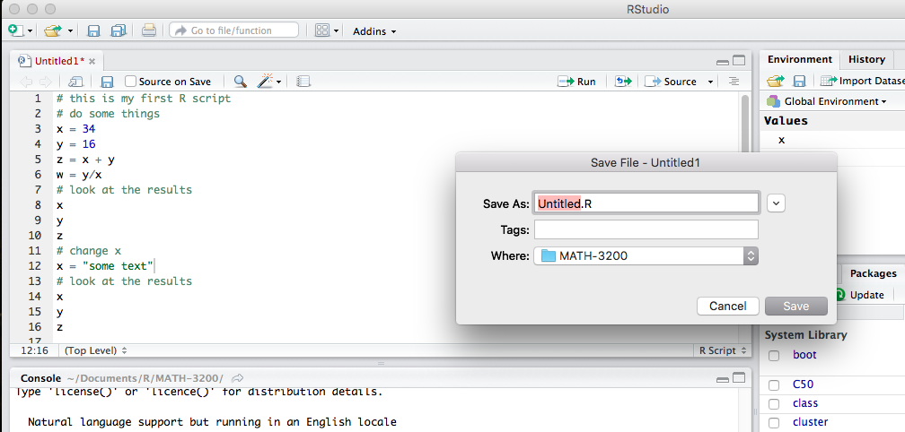
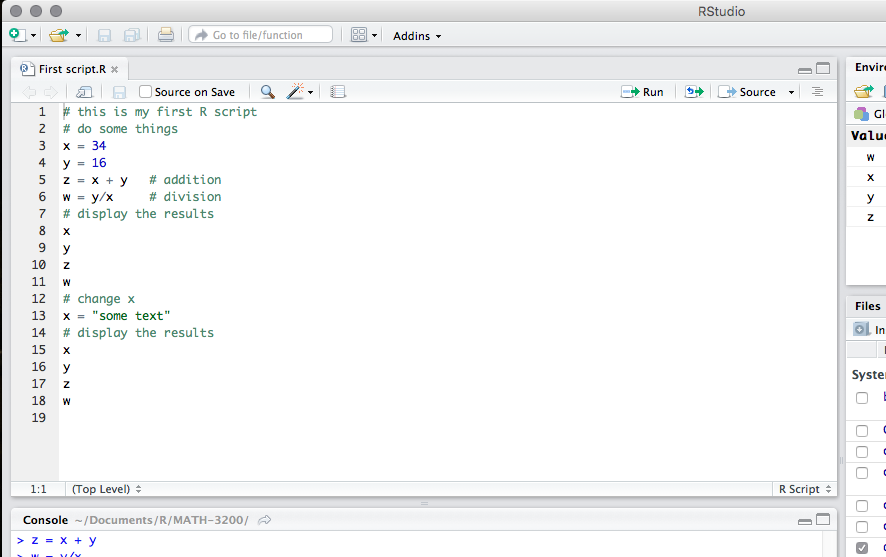

# Introduction

This is part of the practical for Module 1 - Essentials of Mathematics and Statistics part of the [MSc Bioinformatics](https://www.birmingham.ac.uk/postgraduate/courses/taught/med/bioinformatics.aspx) at the University of Birmingham.

This website hosts all practicals for **Module 1**, which covers:

- Linear regression
- Principal Component Analysis (PCA)
- Multivariate Regression
- Generalised Linear Models

## How to use these resources

Section 2 covers some basic concepts on using `R` and `Rstudio`. You should have already covered it, but this is a refresher.

Section 3 contains a link to one of the locations you can download the data from.

The sections after that contain the content of the practical we will go through.

# Getting started in R and Rstudio

You have already started working with `R`, here are just some of the core principles revisited. Ensure you understand them as they are required knowledge and will not be revisited during the module.

## R scripts

While entering and running your code at the R command line is effective and simple. This technique has its limitations. Each time you want to execute a set of commands, you have to re-enter them at the command line. Complex commands are potentially subject to typographical errors, necessitating that they be re-entered correctly. Repeating a set of operations requires re-entering the code stream. Fortunately, R and RStudio provide a method to mitigate these issues. R scripts are that solution. A script is simply a text file containing a set of commands and comments. The script can be saved and used later to re-execute the saved commands. The script can also be edited so you can execute a modified version of the commands.

## Creating an R script

It is easy to create a new script in RStudio. You can open a new empty script by clicking the New File icon in the upper left of the main RStudio toolbar. This icon looks like a white square with a white plus sign in a green circle. Clicking the icon opens the New File Menu. Click the R Script menu option and the script editor will open with an empty script.

```{r, echo = FALSE}
knitr::include_graphics("images/rs-new-file.png")
```

Once the new script opens in the Script Editor panel, the script is ready for text entry, and your RStudio session will look like this.

```{r, echo = FALSE}
knitr::include_graphics("images/rs-file-open.png")
```

Here is an easy example to familiarize you with the Script Editor interface. Type the following code into your new script *(later topics will explain the specific code components do)*.

```{r eval=F}
    # this is my first R script
    # do some things
    x = 34
    y = 16
    z = x + y   # addition
    w = y/x     # division
    # display the results
    x
    y
    z
    w
    # change x
    x = "some text"
    # display the results
    x
    y
    z
    w
```

```{r, echo = FALSE}

```

There, you now have your first R script. Notice how the editor places a number in front of each line of code. The line numbers can be helpful as you work with your code. Before proceeding on to executing this code, it would be a good idea to learn how to save your script.

## Saving an R script

You can save your script by clicking on the Save icon at the top of the Script Editor panel. When you do that, a Save File dialog will open.

```{r, echo = FALSE}

```

## Executing code in an R script

You can run the code in your R script easily. The Run button in the Script Editor panel toolbar will run either the current line of code or any block of selected code. You can use your First script.R code to gain familiarity with this functionality.

Place the cursor anywhere in line 3 of your script \[x = 34\]. Now press the Run button in the Script Editor panel toolbar. Three things happen: 1) the code is transferred to the command console, 2) the code is executed, and 3) the cursor moves to the next line in your script. Press the Run button three more times. RStudio executes lines 4, 5, and 6 of your script.

Now you will run a set of code commands all at once. Highlight lines 8, 9, 10, and 11 in the script.

```{r, echo = FALSE}
knitr::include_graphics("images/rs-run.png")
```

Highlighting is accomplished similar to what you may be familiar with in word processor applications. You click your left mouse button and the beginning of the text you want to highlight, you hold the mouse button and drag the cursor to the end of the text and release the button. With those four lines of code highlighted, click the editor Run button. All four lines of code are executed in the command console. That is all it takes to run script code in RStudio.

### Comments in an R script (documenting your code)

Before finishing this topic, there is one final concept you should understand. It is always a good idea to place comments in your code. They will help you understand what your code is meant to do. This will become helpful when you reopen code you wrote weeks ago and are trying to work with again. The saying, "Real programmers do not document their code. If it was hard to write, it should be hard to understand" is meant to be a dark joke, not a coding style guide.

```{r, echo = FALSE}

```

A comment in R code begins with the `#` symbol. Your code in First `script.R` contains several examples of comments. Lines `1`, `2`, `7`, `12`, and `14` in the image above are all comment lines. Any line of text that starts with `#` will be treated as a comment and will be ignored during code execution. Lines `5` and `6` in this image contain comments at the end. All text after the `#` is treated as a comment and is ignored during execution.

Notice how the RStudio editor shows these comments colored green. The green color helps you focus on the code and not get confused by the comments.

Besides using comments to help make your `R` code more easily understood, you can use the `#` symbol to ignore lines of code while you are developing your code stream. Simply place a `#` in front of any line that you want to ignore. `R` will treat those lines as comments and ignore them. When you want to include those lines again in the code execution, remove the `#` symbols and the code is executable again. This technique allows you to change what code you execute without having to retype deleted code.

# Data sets

For each practical there are some datasets required, you will find all data required for week two of practicals in the data folder [here](https://github.com/anasrana/module1-practical_Bham/tree/master/data). Links to individual datasets requried can be found at the beginning of each practical or on Canvas.